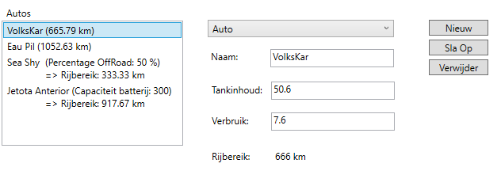
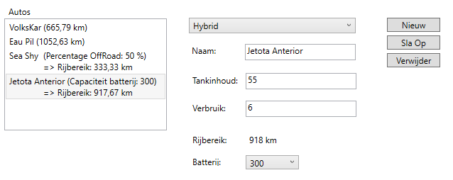
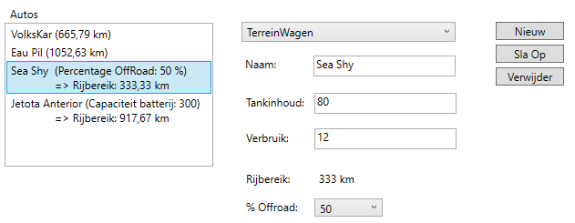

# Geavanceerde klassen: Verschillende soorten auto's

## Aanpassingen auto
- Laat de property RijBereik herberekenen telkens als nodig.
- Zorg ervoor dat de tankinhoud tussen de 40 en de 80 liter kan liggen.
- Zorg ervoor dat het rijbereik van een auto getoond wordt zoals te zien in de screenshot (2 cijfers na de komma).

## Aanpassingen Hybrid
- Laat Hybrid overerven van Auto.
- Pas de constructor aan.
- Laat de property RijBereik herberekenen telkens als nodig.
- Het Rijbereik wordt berekend zoals bij een gewone auto, maar daarbij komt een driehonderdste van de capaciteit van de batterij.
- Zorg ervoor dat het rijbereik van een hybride getoond wordt zoals te zien in de screenshot (2 cijfers na de komma)
- Doe de nodige aanpassing zodat de gegevens van een hybride auto getoond wordt zoals te zien in de screenshot.

## Aanpassingen TerreinWagen
- Laat TerreinWagen overerven van Auto.
- Pas de constructor aan.
- Laat de property RijBereik herberekenen telkens als nodig.
- Het Rijbereik wordt berekend zoals bij een gewone auto, maar wordt vermenigvuldigd met het percentage off-road.
- Zorg ervoor dat het rijbereik van een terreinwagen getoond wordt zoals te zien in de screenshot (2 cijfers na de komma)
- Doe de nodige aanpassing zodat de gegevens van een terreinwagen getoond wordt zoals te zien in de screenshot.

## AutoManagement
- Stel de verschillende autotypes ter beschikking van de gebruiker van de klasse via een array AutoTypes.
- Voorzie de CRUD-operaties.

## Code behind
- Maak dat de namen van de verschillende klassen van autos via KoppelVasteLijsten getoond worden in cmbAutoType.
- Vul KoppelBijkomendeInfo verder aan, zodat in cmbBijkomendeInfo 
  -	bij een terreinwagen de tientallen van 0 tot 100 
  -	bij een hybride wagen de vijftigtallen van 300 – 900
  getoond worden.
- ToonDetails: laat de details van de geselecteerde auto zien, zoals bij de screenshots.
- Voorzie de nodige functionaliteit onder de knoppen om de CRUD-operaties toe te passen.
